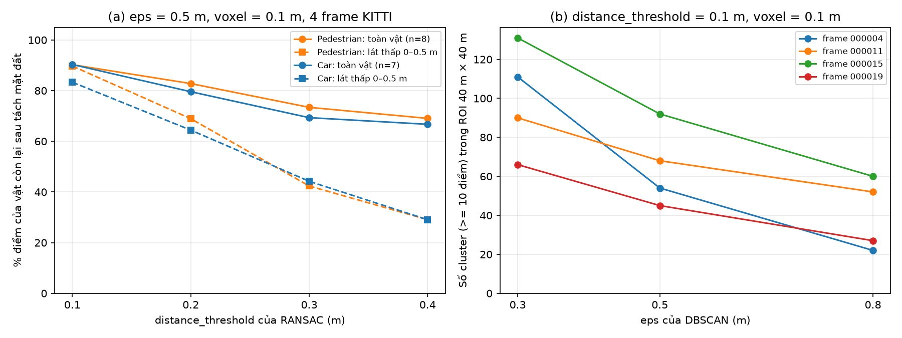
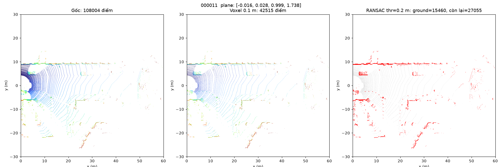

# Báo cáo Day 6: Ngưỡng RANSAC và vật cản thấp sát đất

> Thay **mọi** ô có chữ ĐIỀN nằm trong ngoặc vuông bằng nội dung của bạn, xoá luôn cả dấu ngoặc vuông. Lệnh `python tools/check_submission.py` sẽ báo FAIL nếu còn sót bất kỳ chỗ nào.

- **Họ tên:** Tạ Quang Dũng
- **MSSV:** 2A202602588
- **Lớp:** AI20K-T4
- **Link repo:** https://github.com/taquangdung123/TaQuangDung-2A202602588-Track4-Day21.git
- **Topic:** D — Robot/drone obstacle
- **Dataset:** data/kitti_mini
- **Các frame đã dùng:** 000011, 000015 (nhiều người đi bộ), 000019 (vật rất gần < 6 m), 000004 (xe xa > 50 m)

> Hãy viết ngắn: mỗi mục từ 3 đến 8 dòng, ưu tiên số liệu và hình ảnh.

## 1. Claim

Một câu khẳng định kỹ thuật có thể kiểm chứng. Ví dụ: *"Lệch yaw 1° làm 12% điểm LiDAR rơi ra khỏi vật thể ở 30 m, phát hiện được bằng edge-alignment score với ngưỡng X."*

**Claim (nháp, CP1):** Trên 3 frame KITTI 000011, 000019, 000004 (voxel_size = 0.1 m, DBSCAN eps = 0.5 m), tăng `distance_threshold` của RANSAC ground removal từ 0.1 m lên 0.3 m làm người đi bộ và cyclist trong label mất hơn 30% số điểm sau bước tách mặt đất, và làm tỉ lệ vật được phát hiện thành cluster (tâm cluster cách tâm GT box < 1 m) giảm hơn 20 điểm phần trăm, trong khi với xe con chỉ giảm dưới 5 điểm phần trăm.

## 2. Evidence

Bảng hoặc plot số liệu, kèm ảnh/video demo. Ghi rõ đường dẫn file trong `results/`.

Thí nghiệm: voxel 0.1 m → RANSAC tách mặt đất (numpy, seed = 0) → DBSCAN, ROI phía trước 40 m × 40 m, 4 frame KITTI, 15 vật trong ROI (8 người đi bộ, 7 xe). Mỗi lần chỉ đổi 1 tham số, mốc là `dist_thr = 0.1 m`, `eps = 0.5 m`. Số liệu: `results/obstacle_sweep.csv` (mỗi frame × cấu hình), `results/obstacle_sweep_objects.csv` (mỗi vật), `results/obstacle_latency.csv` (20 lần lặp, bỏ lần đầu, CPU). "Lát thấp" = điểm của vật cao 0–0.5 m trên mặt đất, đại diện cho vật thấp sát đất (pallet, người ngồi).

| Cấu hình | % điểm còn lại: người đi bộ | % điểm còn lại: xe | % điểm còn lại: lát thấp 0–0.5 m | Người đi bộ thành cluster | Số cluster TB/frame | Latency p50 (ms) |
|---|---|---|---|---|---|---|
| dist_thr 0.1 (mốc), eps 0.5 | 90.2 | 90.3 | 86.7 | 8/8 | 64.8 | 164 |
| dist_thr 0.2 | 82.8 | 79.6 | 66.8 | 7/8 | 69.3 | 174 |
| dist_thr 0.3 | 73.4 | 69.3 | 43.2 | 7/8 | 59.0 | 177 |
| dist_thr 0.4 | 69.0 | 66.7 | 29.1 | 7/8 | 57.5 | 176 |
| eps 0.3 (dist_thr 0.1) | 90.2 | 90.3 | 86.7 | 7/8 | 99.5 | 168 |
| eps 0.8 (dist_thr 0.1) | 90.2 | 90.3 | 86.7 | 8/8 | 40.3 | 196 |





- Tăng `distance_threshold` từ 0.1 lên 0.3 m: người đi bộ mất thêm 16.8 điểm phần trăm, xe mất 21.0 điểm phần trăm. Hai class giảm gần như nhau, nên **claim nháp bị bác bỏ** (không có chuyện người đi bộ mất > 30% trong khi xe < 5 điểm phần trăm). Lý do: cả hai đều cao ≥ 1.5 m, RANSAC chỉ cắt mất phần sát đất của mọi vật.
- Thứ bị ảnh hưởng nặng là **lát thấp 0–0.5 m**: chỉ còn 43.2% điểm ở 0.3 m và 29.1% ở 0.4 m (so với 86.7% ở 0.1 m). Một vật cao dưới 0.5 m sẽ mất phần lớn điểm, đúng câu hỏi "vật thấp sát đất" của topic.
- `eps` không đổi số điểm, chỉ đổi cách gom: eps 0.3 m tách vụn (99.5 cluster/frame, 1 người đi bộ 14.5 m bị vỡ thành các mảnh < 10 điểm), eps 0.8 m gộp mạnh (40.3 cluster/frame). Latency toàn pipeline 164–196 ms trên CPU, gần như không phụ thuộc tham số.

## 3. Failure case

Nêu khi nào hệ thống hoặc phương pháp fail, vì sao fail, và liên hệ tới lớp nào trong 6 lớp debug: I/O, Geometry, Time, Preprocess, Model, Metric.


[ĐIỀN]

## 4. Khuyến nghị nếu triển khai thật

Use-case cụ thể (ADAS / robot / drone), trade-off và bước tiếp theo.

[ĐIỀN]

## 5. Cách chạy lại

Các lệnh tái tạo lại toàn bộ kết quả từ repo sạch.

```bash
python -m venv venv && venv\Scriptsctivate      # Windows; Linux/macOS: source venv/bin/activate
set PYTHONUTF8=1                                    # PowerShell: $env:PYTHONUTF8="1" (requirements.txt có tiếng Việt)
pip install -r requirements.txt "open3d>=0.18"

# CP2: kiểm tra phép chiếu + overlay
python -m src.test_projection
python -m starter.projection --data-root data/kitti_mini --frame 000011

# CP2: demo topic D — voxel downsample + tách mặt đất RANSAC (BEV trước/sau)
python -m src.obstacle_demo --frame 000011
python -m src.obstacle_demo --frame 000019
python -m src.obstacle_demo --frame 000004

# CP3: quét dist_thr (0.1/0.2/0.3/0.4 m) và eps (0.3/0.5/0.8 m), có đo latency, rồi vẽ biểu đồ
python -m src.exp_obstacle_sweep --latency-reps 20
python -m src.plot_obstacle_sweep
```

## 6. Khai báo sử dụng AI

Ghi rõ đã dùng công cụ AI nào, dùng vào việc gì, và bạn đã tự kiểm chứng kết quả đó bằng cách nào. Nếu không dùng AI, ghi "Không sử dụng". Xem quy định ở `RULES.md` mục 2.

| Công cụ | Dùng cho việc gì | Bạn đã kiểm chứng thế nào |
|---|---|---|
| Claude Code (Claude Opus 5.5) | Viết 2 hàm TODO(CP2), `src/obstacle_demo.py`, `src/exp_obstacle_sweep.py`, `src/plot_obstacle_sweep.py` và bản nháp các mục REPORT. Không dùng script mẫu topic A (chỉ chép lại hàm `points_in_box`). | `python -m src.test_projection` pass; 3 lệnh overlay khớp đúng 3910 / 19946 / 3120 điểm; mặt phẳng RANSAC có pháp tuyến ≈ (0, 0, 1) và cách sensor ≈ 1.7 m; chạy lại thí nghiệm 2 lần ra CSV giống hệt; [ĐIỀN: phần tự kiểm tra của bạn] |
