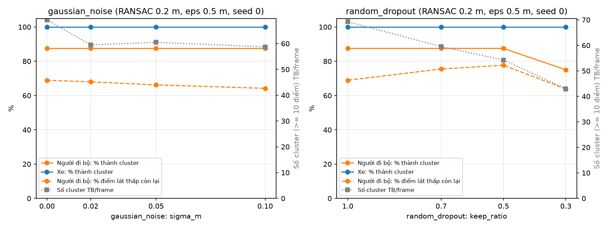
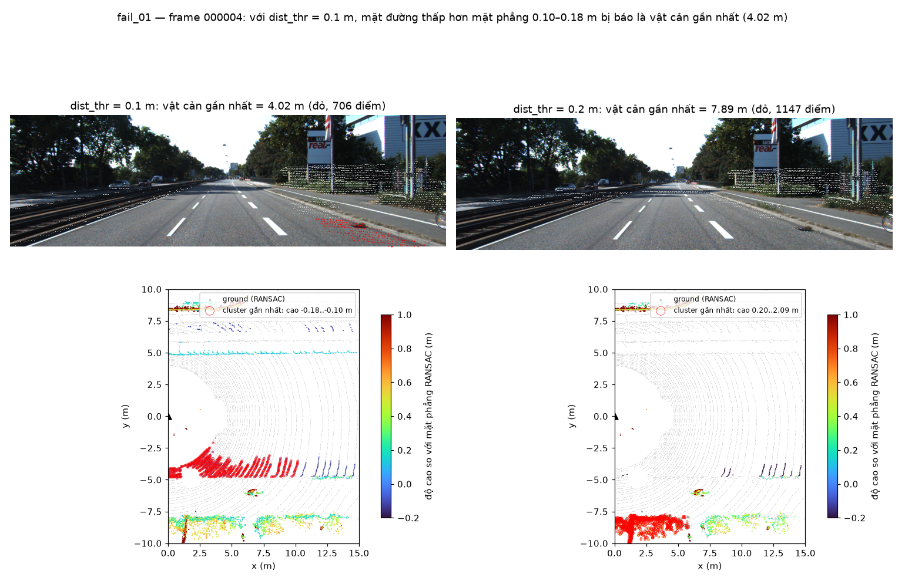
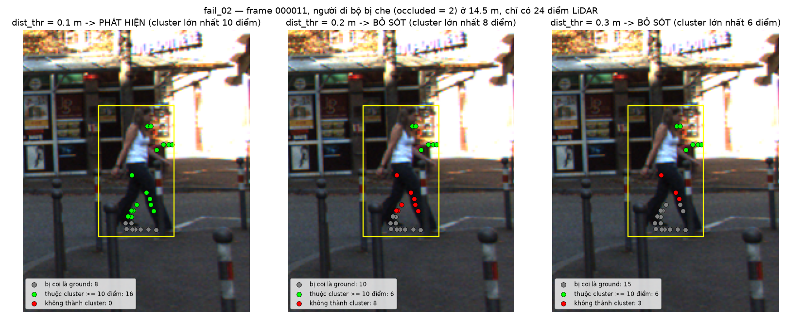

# Báo cáo Day 6: Ngưỡng RANSAC và vật cản thấp sát đất

> Thay **mọi** ô có chữ ĐIỀN nằm trong ngoặc vuông bằng nội dung của bạn, xoá luôn cả dấu ngoặc vuông. Lệnh `python tools/check_submission.py` sẽ báo FAIL nếu còn sót bất kỳ chỗ nào.

- **Họ tên:** Tạ Quang Dũng
- **MSSV:** 2A202602588
- **Lớp:** AI20K-T4
- **Link repo:** https://github.com/taquangdung123/TaQuangDung-2A202602588-Track4-Day21.git
- **Topic:** D — Robot/drone obstacle
- **Dataset:** data/kitti_mini
- **Các frame đã dùng:** 000011, 000015 (nhiều người đi bộ), 000019 (vật rất gần < 6 m), 000004 (xe xa > 50 m); bonus B1 chạy trên cả 20 frame của kitti_mini

> Hãy viết ngắn: mỗi mục từ 3 đến 8 dòng, ưu tiên số liệu và hình ảnh.

## 1. Claim

Một câu khẳng định kỹ thuật có thể kiểm chứng. Ví dụ: *"Lệch yaw 1° làm 12% điểm LiDAR rơi ra khỏi vật thể ở 30 m, phát hiện được bằng edge-alignment score với ngưỡng X."*

**Claim cuối:** Trên 4 frame KITTI (000011, 000015, 000019, 000004), tăng `distance_threshold` của RANSAC từ 0.1 m lên 0.3 m chỉ làm người đi bộ và xe mất thêm 17–21 điểm phần trăm số điểm (vẫn 14/15 vật thành cluster), nhưng làm phần thấp 0–0.5 m sát mặt đất mất hơn một nửa số điểm (còn 43.2% so với 86.7%). Vì vậy ngưỡng cao là nguy hiểm cho **vật thấp dưới 0.5 m**, không phải cho người đi bộ.

**Claim ban đầu (CP1) và kết luận:** claim nháp nói tăng ngưỡng 0.1 → 0.3 m làm người đi bộ mất > 30% điểm và tỉ lệ phát hiện giảm > 20 điểm phần trăm, trong khi xe chỉ giảm < 5 điểm phần trăm. Số liệu **bác bỏ** claim này: người đi bộ mất 16.8, xe mất 21.0 điểm phần trăm (hai class gần như nhau vì đều cao ≥ 1.5 m), tỉ lệ phát hiện người đi bộ chỉ giảm 8/8 → 7/8.

## 2. Evidence

Bảng hoặc plot số liệu, kèm ảnh/video demo. Ghi rõ đường dẫn file trong `results/`.

Thí nghiệm: voxel 0.1 m → RANSAC tách mặt đất (numpy, seed = 0) → DBSCAN, ROI phía trước 40 m × 40 m, 4 frame KITTI, 15 vật trong ROI (8 người đi bộ, 7 xe). Mỗi lần chỉ đổi 1 tham số, mốc là `dist_thr = 0.1 m`, `eps = 0.5 m`. Số liệu: `results/obstacle_sweep.csv` (mỗi frame × cấu hình), `results/obstacle_sweep_objects.csv` (mỗi vật), `results/obstacle_latency.csv` (20 lần lặp, bỏ lần đầu, CPU). "Lát thấp" = điểm của vật cao 0–0.5 m trên mặt đất, đại diện cho vật thấp sát đất (pallet, người ngồi).

| Cấu hình | % điểm còn lại: người đi bộ | % điểm còn lại: xe | % điểm còn lại: lát thấp 0–0.5 m | Người đi bộ thành cluster | Số cluster TB/frame | Latency p50 (ms) |
|---|---|---|---|---|---|---|
| dist_thr 0.1 (mốc), eps 0.5 | 90.2 | 90.3 | 86.7 | 8/8 | 64.8 | 164 |
| dist_thr 0.2 | 82.8 | 79.6 | 66.8 | 7/8 | 69.3 | 174 |
| dist_thr 0.3 | 73.4 | 69.3 | 43.2 | 7/8 | 59.0 | 177 |
| dist_thr 0.4 | 69.0 | 66.7 | 29.1 | 7/8 | 57.5 | 176 |
| eps 0.3 (dist_thr 0.1) | 90.2 | 90.3 | 86.7 | 7/8 | 99.5 | 168 |
| eps 0.8 (dist_thr 0.1) | 90.2 | 90.3 | 86.7 | 8/8 | 40.3 | 196 |


- Tăng `distance_threshold` từ 0.1 lên 0.3 m: người đi bộ mất thêm 16.8 điểm phần trăm, xe mất 21.0 điểm phần trăm. Hai class giảm gần như nhau, nên **claim nháp bị bác bỏ** (không có chuyện người đi bộ mất > 30% trong khi xe < 5 điểm phần trăm). Lý do: cả hai đều cao ≥ 1.5 m, RANSAC chỉ cắt mất phần sát đất của mọi vật.
- Thứ bị ảnh hưởng nặng là **lát thấp 0–0.5 m**: chỉ còn 43.2% điểm ở 0.3 m và 29.1% ở 0.4 m (so với 86.7% ở 0.1 m). Một vật cao dưới 0.5 m sẽ mất phần lớn điểm, đúng câu hỏi "vật thấp sát đất" của topic.
- `eps` không đổi số điểm, chỉ đổi cách gom: eps 0.3 m tách vụn (99.5 cluster/frame, 1 người đi bộ 14.5 m bị vỡ thành các mảnh < 10 điểm), eps 0.8 m gộp mạnh (40.3 cluster/frame). Latency toàn pipeline 164–196 ms trên CPU, gần như không phụ thuộc tham số.

### Bonus

**[B1] So sánh 2 cách tách mặt đất: RANSAC (`dist_thr = 0.2 m`) với cắt độ cao cố định (`z_velo < −1.5 m`, tức ≈ 0.23 m trên mặt đường phẳng).** Cùng voxel 0.1 m, eps 0.5 m, chạy trên **cả 20 frame** KITTI (87 vật trong ROI: 66 xe, 18 người đi bộ, 3 cyclist). File: `results/bonus_b1_ground_compare*.csv`.

| Metric | RANSAC 0.2 m | Cắt độ cao −1.5 m |
|---|---|---|
| % điểm còn lại: người đi bộ / xe | 85.6 / 84.9 | 98.6 / 93.3 |
| % điểm lát thấp 0–0.5 m còn lại: người đi bộ | 64.9 | 93.8 |
| Người đi bộ thành cluster | 17/18 (94.4%) | 18/18 (100%) |
| Xe thành cluster | 65/66 | 66/66 |
| Cụm dẹt (dày < 0.2 m, > 2 m²: ứng viên mặt đường báo nhầm), tổng 20 frame | **66** | **95** |
| Thời gian bước tách mặt đất p50 | 32.1 ms | 0.2 ms |

- Cắt độ cao giữ vật tốt hơn và nhanh hơn ~150 lần, nhưng **giả định đường phẳng và LiDAR cao đúng 1.73 m**: ở frame 000009, 000011, 000049 RANSAC có 0 cụm dẹt còn cắt độ cao có 6 / 8 / 4, tức có những mặt phẳng rộng, mỏng (có thể là đoạn đường dốc, vỉa hè hoặc bãi cỏ nghiêng, chưa kiểm chứng từng cụm) nằm cao hơn −1.5 m và bị báo là vật cản. Trên robot có rung lắc (pitch) hoặc dốc, cách này sẽ báo nhầm nhiều hơn.
- RANSAC tự thích nghi với độ nghiêng của mặt đường nhưng vẫn là 1 mặt phẳng nên vẫn còn cụm dẹt (fail 01), và cắt nhiều hơn ở phần chân vật. Lưu ý: cột "lát thấp" của cắt độ cao tính độ cao bằng `z + 1.73`, không cùng mốc với RANSAC, nên chỉ so sánh tương đối.

**[B2] Stress test: nhiễu Gauss (σ = 0 / 0.02 / 0.05 / 0.1 m) và random dropout (giữ 100 / 70 / 50 / 30% điểm), seed = 0.** Pipeline RANSAC 0.2 m, eps 0.5 m, 4 frame CP3. Vật bị suy giảm xuống dưới 10 điểm vẫn được tính là **bỏ sót** (không bị loại khỏi mẫu). File: `results/bonus_b2_stress*.csv`, hình `results/figures/bonus_b2_stress.png`. Chạy lại 2 lần ra CSV giống hệt.



- Nhiễu tới 10 cm **không làm mất vật nào** (xe 7/7, người đi bộ 7/8 ở mọi mức, người bị mất là ca fail 02 có sẵn), vì voxel 0.1 m lấy trung bình điểm. Cái mất là lát thấp của người đi bộ (68.9% → 64.2%) và cụm của người 14.5 m vỡ dần (8 → 5 điểm).
- Dropout an toàn tới 50%. Ở **30%**, người đi bộ ở **34.2 m** (frame 000011) còn **0 điểm** trong box → tỉ lệ phát hiện người đi bộ giảm 87.5% → 75%, xe vẫn 100%. Số cluster/frame giảm 69 → 43: pipeline "trông sạch hơn" trong khi thực ra mất vật xa.

**[B3] Latency từng bước, đo đúng cách.** 4 frame × 2 cách tách mặt đất × (1 warm-up + 20 lần), mỗi dòng CSV là 1 lần chạy: `results/bonus_b3_latency_runs.csv` (có cột `warmup`, cột phần cứng). Phần cứng: **AMD Ryzen 5 5600H, RAM 7.3 GB, Windows 11, Python 3.11.9, chỉ chạy CPU** (máy có RTX 3050 Ti nhưng pipeline không dùng GPU).

| Bước (ms) | RANSAC p50 / p95 | Cắt độ cao p50 / p95 |
|---|---|---|
| Voxel downsample (open3d) | 113.4 / 156.8 | 103.8 / 131.7 |
| Tách mặt đất | 32.1 / 57.8 | 0.2 / 0.4 |
| DBSCAN (open3d) | 18.3 / 36.1 | 19.6 / 39.7 |
| **Tổng** | **166.9 / 211.0** | **128.8 / 154.1** |

- Bước chậm nhất là **voxel downsample** (~70% thời gian), không phải RANSAC hay DBSCAN. Phần lớn là chi phí chuyển ~110 nghìn điểm từ numpy sang open3d. Ở 10 Hz (100 ms/frame) pipeline chưa đạt real-time trên CPU này; nên làm voxel bằng numpy hoặc cắt ROI trước khi downsample.

## 3. Failure case

Nêu khi nào hệ thống hoặc phương pháp fail, vì sao fail, và liên hệ tới lớp nào trong 6 lớp debug: I/O, Geometry, Time, Preprocess, Model, Metric.

Hai failure case ngược chiều nhau, cho thấy `distance_threshold` không có giá trị nào an toàn cho cả hai phía. Tạo lại ảnh: `python -m src.fail_cases`.

### Fail 01: mặt đường bị báo là vật cản gần nhất (ngưỡng thấp)



- **Trường hợp:** KITTI frame 000004, voxel 0.1 m, `dist_thr = 0.1 m`, eps 0.5 m.
- **Quan sát:** vật cản gần nhất được báo ở **4.02 m**, là một cụm 706 điểm, kích thước 10.2 × 2.8 m nhưng chỉ dày **0.14 m**, nằm **thấp hơn** mặt phẳng RANSAC 0.10–0.18 m. Chiếu lên ảnh, cụm này nằm trên mặt đường/lề đường bên phải, không có vật nào ở đó. Khi tăng lên 0.2 m, cụm biến mất và vật cản gần nhất thật là 7.89 m (cụm cao 0.20–2.09 m). Báo sai gần gấp đôi khoảng cách thật.
- **Nguyên nhân:** RANSAC chỉ fit **một mặt phẳng** cho cả ROI 40 m. Mặt đường thật bị nghiêng ngang (camber) và dốc dần về lề, nên phần đường phía bên phải thấp hơn mặt phẳng đã fit hơn 0.1 m. Các điểm đường đó nằm ngoài ngưỡng ±0.1 m nên bị coi là "không phải ground" và DBSCAN gom chúng thành một cụm lớn.
- **Lớp debug:** Preprocess (mô hình mặt đất một mặt phẳng + ngưỡng quá chặt so với độ cong của đường). Không phải Geometry: calibration và plane fit đều đúng (pháp tuyến ≈ (0, 0, 1), sensor cao ≈ 1.73 m).
- **Cách phát hiện khi chạy thật:** cảnh báo cluster "dẹt": chiều cao cụm < 0.2 m mà diện tích > 2 m², hoặc toàn bộ điểm nằm **dưới** mặt phẳng ground. Cách sửa: fit mặt đất theo từng ô/sector (ví dụ lưới 10 m) thay vì một mặt phẳng.

### Fail 02: người đi bộ bị che biến mất (ngưỡng cao)



- **Trường hợp:** KITTI frame 000011, người đi bộ ở 14.5 m, bị che nhiều (`occluded = 2`), chỉ có 24 điểm LiDAR sau voxel 0.1 m.
- **Quan sát:** `dist_thr` 0.1 m: ground lấy 8/24 điểm, cụm lớn nhất 10 điểm → vừa đủ ngưỡng (≥ 10), phát hiện. 0.2 m: ground lấy 10 điểm, phần chân còn lại (8 điểm đỏ) không tạo được cụm ≥ 10, 6 điểm thân trên bị gộp chung vào một cụm khác ở ngoài box → **bỏ sót**. 0.3 m: ground lấy 15/24 điểm.
- **Nguyên nhân:** 17/24 điểm của người này nằm trong 0–0.5 m trên mặt đất (chân), vì thân trên bị cột/biển che. LiDAR 64 beam ở 14.5 m chỉ có vài beam quét trúng người. Tăng ngưỡng làm mất phần chân, phần còn lại quá thưa nên DBSCAN (eps 0.5 m, min 10 điểm) không gom được.
- **Lớp debug:** Preprocess (ngưỡng ground + ngưỡng số điểm tối thiểu của cụm), cộng thêm giới hạn sensor (mật độ beam ở xa, vật bị che).
- **Cách phát hiện khi chạy thật:** theo dõi `low_kept_ratio` (tỉ lệ điểm 0–0.5 m còn lại, ở CP3 giảm 86.7% → 43.2% khi 0.1 → 0.3 m); cảnh báo khi có cụm ≥ 3 điểm nằm sát mặt đất nhưng bị loại do < 10 điểm trong vùng 20 m quanh robot.

## 4. Khuyến nghị nếu triển khai thật

Use-case cụ thể (ADAS / robot / drone), trade-off và bước tiếp theo.

- **Use-case:** robot tự hành trong kho (AMR), tốc độ ≤ 2 m/s, vật cản cần bắt được gồm cả vật thấp: pallet (~0.15 m), xe đẩy, người ngồi xổm.
- **Chọn tham số:** RANSAC `dist_thr` **0.1 m** (không dùng 0.3 m: lát 0–0.5 m chỉ còn 43%), eps **0.5 m** (0.3 m làm vỡ người đi bộ, 0.8 m gộp vật gần nhau), cluster tối thiểu 10 điểm. Sàn kho phẳng hơn đường phố, nên ngưỡng 0.1 m ít bị lỗi fail 01 hơn trên KITTI.
- **Trade-off:** ngưỡng thấp → báo nhầm mặt sàn là vật cản (fail 01, robot phanh vô cớ); ngưỡng cao → mất vật thấp và vật xa ít điểm (fail 02). Với robot, phanh nhầm rẻ hơn đâm vào pallet, nên ưu tiên ngưỡng thấp, rồi lọc cụm dẹt (dày < 0.2 m, diện tích > 2 m²) thay vì tăng ngưỡng.
- **Chỉ số cần ghi log (mỗi frame, gộp theo phút):** (1) số cụm dẹt (dày < 0.2 m, > 2 m²) trong vùng 5 m quanh robot, > 0 trong 10 frame liên tiếp thì cảnh báo mô hình mặt đất sai (fail 01); (2) pháp tuyến và độ cao mặt phẳng RANSAC, lệch > 5° hoặc > 0.1 m so với giá trị lắp đặt thì cảnh báo sàn dốc hoặc cảm biến bị xê dịch; (3) số cluster/frame, giảm > 30% so với trung bình 1 phút trước thì cảnh báo mất điểm (B2: dropout 30% làm số cluster giảm 69 → 43); (4) latency p95, > 200 ms thì giảm tần số hoặc thu nhỏ ROI.
- **Bước tiếp theo:** (1) fit mặt đất theo từng ô lưới thay cho 1 mặt phẳng; (2) đo recall trên vật thấp thật (KITTI không có label pallet, cần tự thu dữ liệu kho); (3) tăng tốc voxel để đạt 10 Hz (hiện p50 167 ms trên Ryzen 5 5600H, B3); (4) giám sát khi chạy: cảnh báo nếu số cụm dẹt > 0 trong vùng 5 m, hoặc số cluster/frame giảm đột ngột (dấu hiệu mất điểm như B2).

## 5. Cách chạy lại

Các lệnh tái tạo lại toàn bộ kết quả từ repo sạch.

```bash
git clone -c core.longpaths=true https://github.com/taquangdung123/TaQuangDung-2A202602588-Track4-Day21.git   # Windows: tên file nuScenes rất dài
cd TaQuangDung-2A202602588-Track4-Day21
python -m venv venv && venv\Scriptsctivate      # Windows; Linux/macOS: source venv/bin/activate
set PYTHONUTF8=1                                    # PowerShell: $env:PYTHONUTF8="1" (requirements.txt có tiếng Việt)
pip install -r requirements.txt "open3d>=0.18"

# CP2: kiểm tra phép chiếu + overlay
python -m src.test_projection
python -m starter.projection --data-root data/kitti_mini --frame 000011

# CP2: demo topic D — voxel downsample + tách mặt đất RANSAC (BEV trước/sau)
# (demo này dùng open3d.segment_plane, số điểm ground có thể lệch vài trăm giữa các lần chạy; mọi CSV ở CP3/bonus dùng RANSAC có seed nên chạy lại ra giống hệt)
python -m src.obstacle_demo --frame 000011
python -m src.obstacle_demo --frame 000019
python -m src.obstacle_demo --frame 000004

# CP3: quét dist_thr (0.1/0.2/0.3/0.4 m) và eps (0.3/0.5/0.8 m), có đo latency, rồi vẽ biểu đồ
python -m src.exp_obstacle_sweep --latency-reps 20
python -m src.plot_obstacle_sweep

# CP4: ảnh failure case
python -m src.fail_cases

# Bonus [B1] [B2] [B3] — mỗi lệnh có --help đầy đủ ([B4])
python -m src.exp_obstacle_bonus compare     # B1, 20 frame KITTI
python -m src.exp_obstacle_bonus stress      # B2, tạo results/figures/bonus_b2_stress.png
python -m src.exp_obstacle_bonus latency     # B3, mỗi dòng CSV là 1 lần chạy
```

**[B4] Tool dùng lại được:** `src/exp_obstacle_sweep.py` và `src/exp_obstacle_bonus.py` có argparse, mọi tham số đều có `help=` và in giá trị mặc định, chạy không tham số vẫn ra kết quả. Xem hướng dẫn bằng:

```bash
python -m src.exp_obstacle_sweep --help
python -m src.exp_obstacle_bonus --help
python -m src.exp_obstacle_bonus stress --help
```

Ví dụ dùng lại cho dataset/frame khác: `python -m src.exp_obstacle_sweep --frames 000016 000049 --dist-levels 0.05 0.1 0.15 --out results/my_sweep.csv`.

## 6. Khai báo sử dụng AI

Ghi rõ đã dùng công cụ AI nào, dùng vào việc gì, và bạn đã tự kiểm chứng kết quả đó bằng cách nào. Nếu không dùng AI, ghi "Không sử dụng". Xem quy định ở `RULES.md` mục 2.

| Công cụ | Dùng cho việc gì | Bạn đã kiểm chứng thế nào |
|---|---|---|
| Claude Code (Claude Opus 5.5) | Viết 2 hàm TODO(CP2), `src/obstacle_demo.py`, `src/exp_obstacle_sweep.py`, `src/plot_obstacle_sweep.py`, `src/fail_cases.py`, `src/exp_obstacle_bonus.py` và bản nháp các mục REPORT. Không dùng script mẫu topic A (chỉ chép lại hàm `points_in_box`). | `python -m src.test_projection` pass; 3 lệnh overlay khớp đúng 3910 / 19946 / 3120 điểm; mặt phẳng RANSAC có pháp tuyến ≈ (0, 0, 1) và cách sensor ≈ 1.7 m; chạy lại thí nghiệm 2 lần ra CSV giống hệt; đối chiếu số trong bảng mục 2 với CSV; mở từng ảnh overlay, BEV và fail_* để xem điểm khớp vật thể; clone repo sạch và chạy lại toàn bộ lệnh mục 5 ra cùng số liệu |
